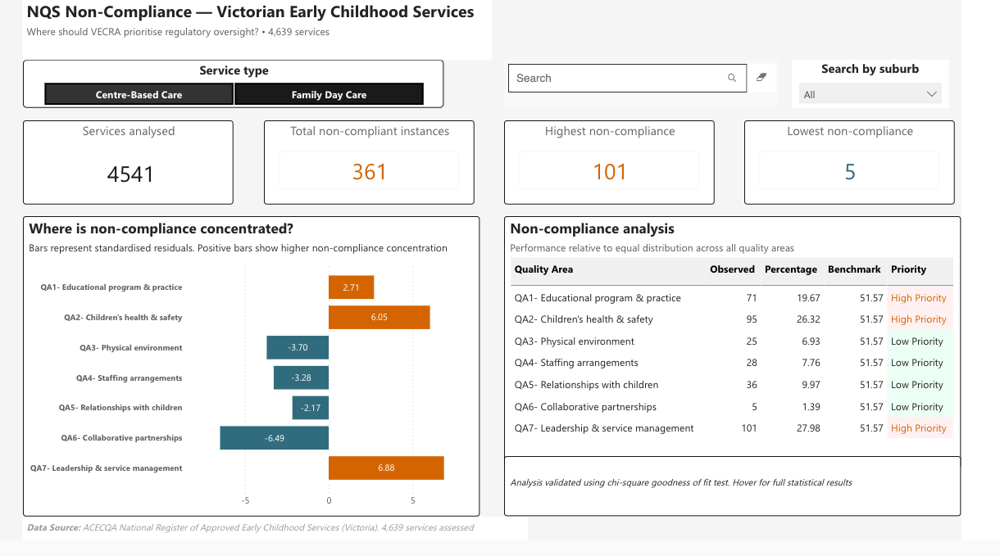
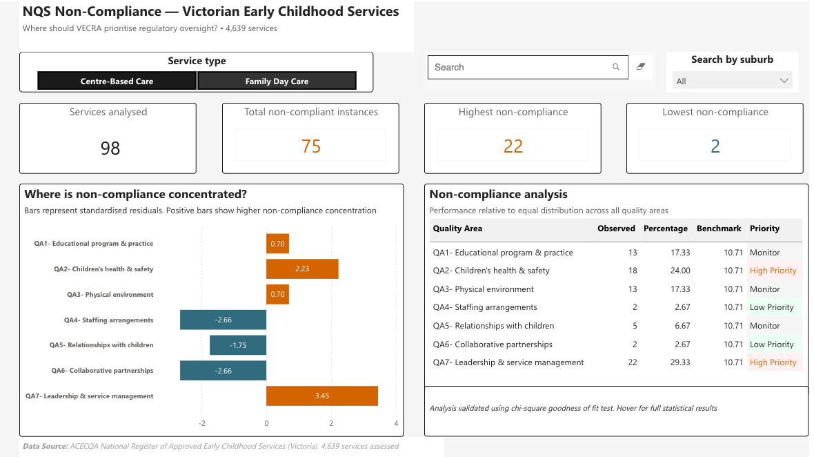

# VECRA-Compliance-Dashboard
Built an interactive regulatory compliance analytics dashboard in Power BI and Excel to analyse non-compliance distribution across NQS quality areas for Victorian centre-based care and family day care services through statistical analysis and stakeholder-focused reporting.

## Live Interactive Dashboard

[Open Dashboard](https://app.powerbi.com/view?r=eyJrIjoiZmUyZDUwZTYtYzYwYy00OGIwLWJkODItMGQ1YmY2OTY4ZWU4IiwidCI6ImZjZjAyZDc5LTE4NGQtNDA4Yy05NTI4LWZjZTMzMzc1YWIzZSJ9)

## Business Problem
Business Context

Victorian early childhood services are assessed against seven National Quality Standard (NQS) quality areas by the Victorian Early Childhood Regulatory Authority (VECRA). However, limited visibility exists into whether non-compliance is evenly distributed across these quality areas or concentrated within specific regulatory risk areas requiring greater monitoring attention.

### Research Question

Are non-compliance counts equally distributed across the seven NQS quality areas for centre-based care and family day care services in Victoria?

## Tools Used

- Microsoft Excel — data cleaning, chi-square analysis, standardised residuals, Cohen's W
- Power BI — interactive dashboard, DAX measures, conditional formatting

## Dataset

- Source: ACECQA National Register of Approved Early Childhood Services (Victoria)
- Records: 4,639 assessed services
- Service types: Centre-Based Care (n = 4,541) · Family Day Care (n = 98)
- Variables: 20 columns including service name, provider, suburb, postcode and NQS ratings for all 7 quality areas
- Cleaning: 396 rows removed (unassessed services) to ensure data quality assurance · Binary Compliant/Non-Compliant classification applied · Overall rating column removed

## Methodology

### Hypotheses

- H₀₁: Non-compliance counts are equally distributed across all 7 NQS quality areas for centre-based care services in Victoria
- H₀₂: Non-compliance counts are equally distributed across all 7 NQS quality areas for family day care services in Victoria

### Statistical test

Chi-square goodness of fit test — tested whether observed non-compliance counts deviated significantly from the expected equal distribution across 7 quality areas

### Effect size

Cohen's W — measured practical significance beyond statistical significance

### Results

| Service Type | χ² | df | p-value | Cohen's W | Effect |
|---|---|---|---|---|---|
| Centre-Based Care | 162.49 | 6 | < 0.001 | 0.671 | Large |
| Family Day Care | 35.04 | 6 | < 0.001 | 0.684 | Large |

Both H₀ hypotheses rejected — non-compliance is significantly and meaningfully concentrated in specific quality areas for both service types.

## Key Insights

- QA7 (Leadership and service management) is the highest priority area for both service types — 27.9% CBC · 29.3% FDC
- QA2 (Children's health and safety) is the second highest — 26.3% CBC · 24.0% FDC
- QA7 and QA2 together account for over 54% of all non-compliance for both service types
- QA6 (Collaborative partnerships) recorded the lowest share of non-compliance for both service types (1.4% for CBC and 2.67% for FDC).
- QA3 (Physical environment) accounts for 17.3% of FDC non-compliance — the third highest area after QA7 and QA2, suggesting physical environment is a notable concern for family day care services
- Both service types show large effect sizes (Cohen's W > 0.50) confirming the pattern is practically meaningful

## Dashboard Features

- Service type slicer — toggle between Centre-Based Care and Family Day Care
- Suburb filter — search and filter by suburb across Victoria
- 4 KPI cards — services analysed, total non-compliant instances, highest non-compliance, lowest non-compliance
- Diverging bar chart — standardised residuals by quality area with colour intensity showing magnitude
- Non-compliance analysis table — quality area, observed count, percentage share, benchmark, priority — fully dynamic
- Chi-square tooltip — hover over any row or bar to see full statistical results
- Conditional formatting — High Priority in orange, Low Priority in teal blue, Monitor in grey

## Recommendations

- QA7 may warrant closer monitoring due to its consistently high concentration of non-compliance (accounts for ~29% of non-compliance across both service types)
- QA2 may benefit from additional regulatory attention together with QA7 (over 54% of non-compliance is in these two areas)
- Targeted FDC support for QA3 — physical environment non-compliance significantly higher for family day care
- QA6 may require less intensive monitoring relative to higher-risk areas, given its consistently low share of non-compliance across both service types.

## Dashboard Preview

### Centre-Based Care

### Family Day Care

